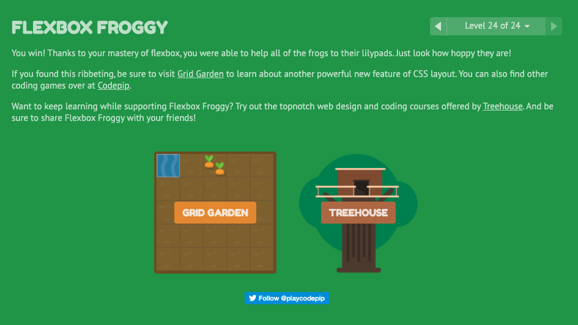

### Flexbox and Templating

#### Templating with Mustache

* Logic-less template syntax
  * Named after use of curly braces
* Fast and efficient technique to render client-side view template with JavaScript by using JSON data source
* Template is HTML mrkup
* Template then replaces the variables and instances with actual values at runtime
* It is logic-less because it has no if/else statements and no for loops
* Instead, there are only tags
* Double curly braces show a "placeholder", which is then replaced with actual value
* Mustache-express  can be used with Node and Express

#### A Guide To Flexbox

* Flexbox is designed to provide a more efficient way to lay out, align and distribute space among items in a container
* It gives the container the ability to alter its items' width/height to best fill the available space
* Flex containers expand to fill empty space and shrink to prevent overflow
* Flexbox is direction-agnostic, meaning it can be applied to both vertical and horizontal layout alignment

* Terms
  * Main axis - main axis of flex container is the primary axis along which items are laid out
  * main-start | main-end - Beginning and ending of primary axis
  * main size - A flex item's main dimension, width or height
  * Cross axis - Perpendicular axis
  * Cross-start | Cross-end - Beginning and ending of perpendicular axis
  * Cross size - Width or height of flex item in cross dimension

* Properties
  * Display - Defines flex container
  * Order - Determines order of flex items
  * flex-direction: row, row-reverse, column, column-reverse
  * flex-grow: Ability for flex item to grow if necessary
  * flex-wrap: nowrap, wrap, wrap-reverse
  * flex-shrink: Ability for flex item to shrink if necessary
  * flex-flow: Shorthand for flex-direction and flex-wrap properties
  * flex-basis: Defines default sie of an element before remaining space is distributed
  * Justify-content: flex-start, flex-end, center, space-between, space-around, space-evenly
  * flex - Shorthand for flex-grow, flex-shrink, and flex-basis
  * align-self: Default alignment overridden for individual flex items
    * auto, flex-start, flex-end, center, baseline, stretch
  * Align-items: Default behavior for how flex items are laid out across the cross axis
    * flex-start, flex-end, center, stretch, baseline
    * Justify-content version for the cross axis
  * Align-content - flex-start, flex-end, center, stretch, space-between, space-around
    * Aligns flex container's lines within when there is extra space in the cross-axis
    * Cross axis version of justify-content

#### Flexbox Froggy

### This was a fun game and I definitely learned a lot

