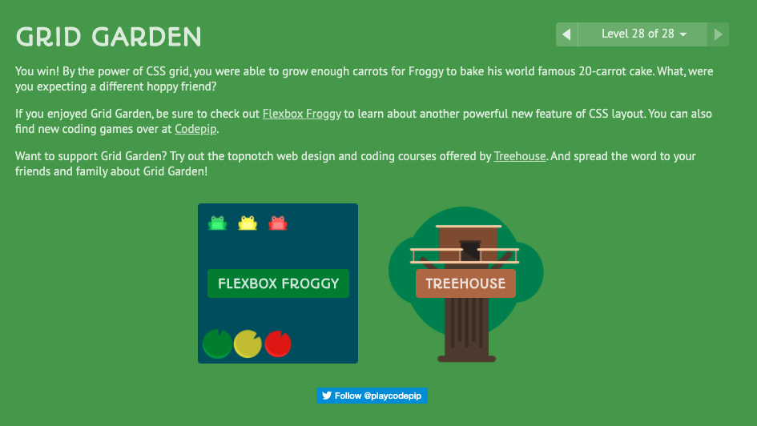

### Responsive Web Design and Regular Expressions

#### CSS Grid Garden

Another fun challenge. I'm excited to learn more about CSS grids

#### Regex Tutorial

* Regex stands for **regular expressions**
* Useful in extracting information from any text 
* Search for matches of a specific pattern
* Can be used in most programming languages
* Search patter is commonly delimited by two slash characters, like this: /abc/
  * Add **g** to search beyond the first match
  * Add **m** to ^ and $ to match the start and end of a line instead of the whole string
  * Add **i** to make the expression case sensitive